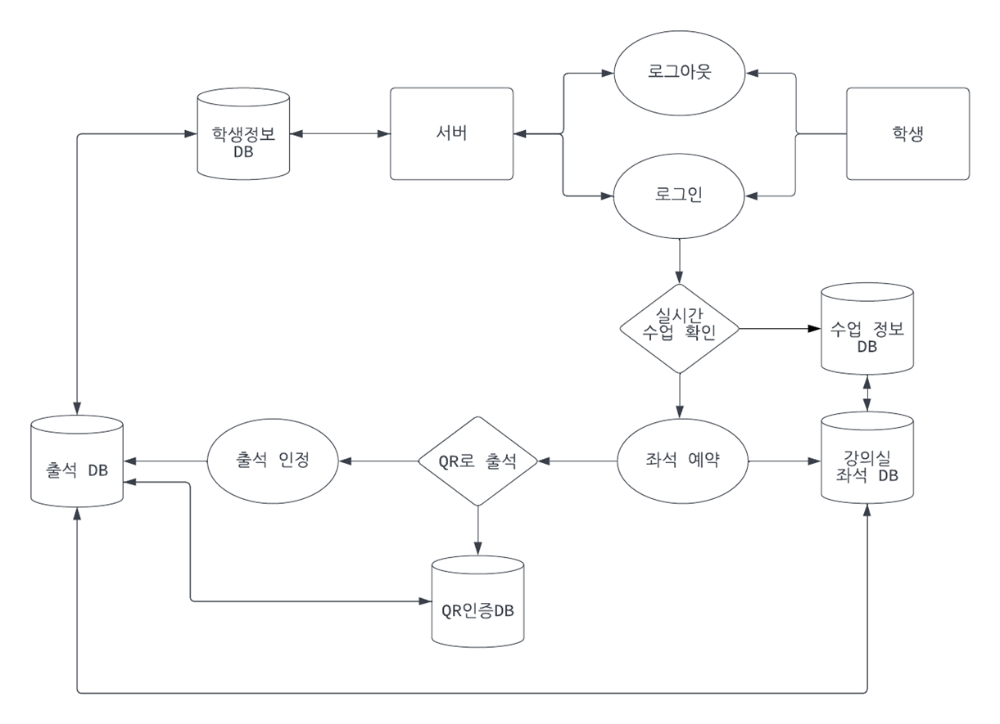
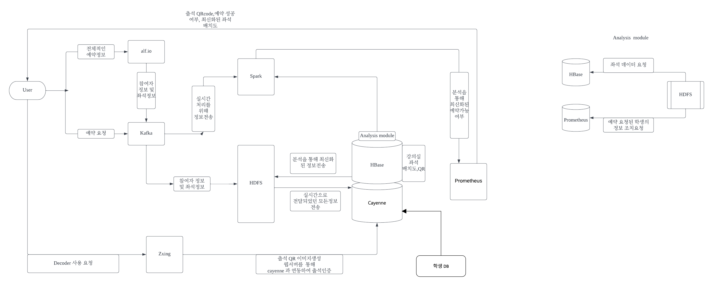
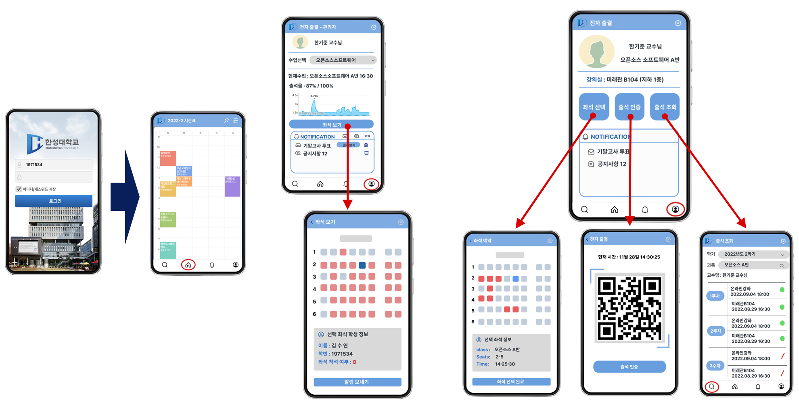

 

  

<h1>수업 좌석 예약 시스템</h1>

<h3>1조 & 3조</h3>

    <h5>2171344 강민서</h5>
    <h5>2171443 권다은</h5>
    <h5>1971408 권상민</h5>
    <h5>1971534 김수연</h5>
    <h5>1971093 김수정</h5>
    <h5>2171395 김승윤</h5>
    <h5>1971396 김인서</h5>

   
---

<h2>목차</h2>
 

<b>1. 소개</b>

 &nbsp;&nbsp; ​	1.1 문서의 목적

 &nbsp;&nbsp; ​	1.2 유사 서비스 분석

<b>2. 시스템 설계 개요</b>

&nbsp; &nbsp;​	2.1 배경 정보

&nbsp; &nbsp;​	2.2 시스템 발전 설명

&nbsp; &nbsp;​	2.3 전체적인 서비스 흐름

<b>3. 논리적 구조</b>

<b>4. 사용한 오픈소스</b>

&nbsp;&nbsp; ​	4.1 ZXing

&nbsp; &nbsp;​	4.2 Apache Spark

&nbsp; &nbsp;​	4.3 Apache Kafka

&nbsp; &nbsp;​	4.4 HDFS(Hadoop Distributed Filesystem)

&nbsp; &nbsp;​	4.5 Apache HBase

&nbsp; &nbsp;​	4.6 Apache Cayenne

&nbsp; &nbsp;​	4.7 Prometheus

&nbsp; &nbsp;​	4.8 Alf.io

&nbsp;&nbsp; ​	4.9 최종 라이선스

<b>5. 그래픽 사용자 인터페이스(GUI)</b>

   

---

<h1>1 소개</h1>

 

<h2>1.1 문서의 목적</h2>

한성대학교 재학생이자 서비스 제공자 입장에서 바라보았을 때, 우리가 직접적으로 접하고 있는 서비스는 무엇이 있을까 생각을 하던 중 전자 출결 시스템을 떠올리게 되었다. 현재 우리학교의 출석 방식은 강의실에 들어와서 핸드폰 블루투스를 켜서 정해진 구역 내에 있다면 출석이 인증되는 방식이다. 하지만 강의실 내부와 강의실 외부의 경계가 모호해서 강의실 외부에서 출석만 하고 수업을 빠지는 경우가 다수 존재한다. 몇몇 교수님들은 전자 출결로 출석을 확인하지 않고 직접 출석을 부르시기에 현재 전자 출결 어플이 효율성이 떨어진다고 할 수 있다.

 
 

<h2>1.2 유사 서비스 분석 & 기존 서비스와의 차이점</h2>

기존 어플에는 강의실 좌석 예약 시스템이 없지만, 우리가 구현하고자 하는 서비스에는 강의실 좌석 예약 시스템이 포함되어 있다. 이로 인해 학생 개개인이 각자가 원하는 위치의 좌석을 예약하여 수업에 더욱 집중할 수 있는 환경을 제공할 것이다. 그리고 앞서 설명한 출석만 하고 수업을 듣지 않는 경우를 방지할 수 있는 방법을 고안하던 중 QR코드를 활용한 출석체크 방식을 떠올리게 되었다.

  
---

<h1>2 시스템 설계 개요</h1>

 

<h2>2.1 배경 정보</h2>

현재 전자출결에는 출석체크, 출석조회, 시간표, 환경설정 기능이 있다.

- 출석체크
  -  현재 강의가 있다면 강의 정보와 출석체크를 할 수 있는 버튼이 있다.
  -  현재 강의가 없다면 강의정보가 없다는 문구가 뜬다.
- 출석조회
  - 학기와 과목명을 선택하면 교수명과 주차별 출석조회을 확인 할 수 있다.
- 시간표
  - 종합정보시스템의 시간표처럼 현재학기에 듣고 있는 시간표를 확인 할 수 있다.
- 환경설정
  - 로그인정보, 단말기 정보, 프로그램정보 등을 확인할 수 있다.

 

<h2>2.2 시스템 발전 설명</h2>

현재 존재하는 한성대학교 전자출결앱을 v1.0이라고 했을 때, 우리가 강의실 좌석 예약 기능을 추가하고 출석 체크 방식을 QR코드를 활용한 것으로 수정한 앱은 v2.0으로 나타낼 수 있다. 이후 새로운 주요한 기능들이 추가될 때 마다 버전을 업그레이드 하면 된다.

 

<h2>2.3 전체적인 서비스 흐름</h2>

 

---

<h1>3 논리적 구조</h1>

-  User에서 전체적인 예약 정보, 예약 요청, Decoder 사용 요청을 각각 aif.io, Kafka, Zxing으로 보낸다. 먼저 전체적인 예약 정보를 받은 aif.io는 참여자 정보 및 좌석 정보를 예약 요청을 받은 Kafka로 보내 실시간 처리를 위해 Spark로 전송, 또한 참여자 정보 및 좌석 정보 확인을 위해 HDFS로 보낸다. HDFS는 실시간으로 전달되었던 모든 정보를 Cayenne로 전송한다. Cayenne는 Decoder 사용 요청을 Zxing로부터 받고 출석 QR 이미지 생성 웹서버를 통해 Cayenne 와 연동하여 출석 인증을 한다. 그 후 Hbase는 강의의 실 좌석 배치도, QR를 받고 분석을 통해 최 신화된 정보를 HDFS로 전송, Hbase는 analysis module를 사용하여 Spark로 정보를 전송하게 된다. Analysis Module은 HDFS가 좌석 데이터 요청을 HBase, 예약 요청된 학생의 정보 조치 요청을 각각 Cayenne으로 하도록 한다. 그 정보를 다시 Spark로 전송해 분석을 통해 최신화된 예약 가능 여부를 Promethus가 확인하여 출석 QR code, 예약 성공 여부와 최신화된 좌석 배치도를 다시 User에게 전송한다.

---

<h1>4 사용한 오픈소스</h1>

 

<h2>4.1 ZXing</h2>

***ZXing란?***

안드로이드에서 QR코드 생성 및 QR스캔, Barcode 스캔에 도움을 주는 구글에서 제공하는 오픈소스

 

***특징***

- 내장 카메라 앱을 이용하여 바코드나 Qr코드를 스캔하고 인코딩된 데이터를 검색할 수 있게한다.
- 1차원 또는 2차원의 그래픽 QR코드, 바코드를 인식하는데 코드에 지정된 웹 주소, 지리학적 좌표, 텍스트등에 바로 넘어갈 수 있게 할 수있다. 
- QR코드를 찍으면 YUV라는 포멧으로 데이터를 보내주는 데 데이터를 변환하여 사용해야하는 데 ZXing자체에 데이터 변환소스가 포함되어있다. (PlanarYUVLuminanceSource)
- 넘어온 QR코드 데이터를 사용하여 여러가지 기능을 구현할 수 있다.

 
***제약 사항***

format에 맞는 제품을 사용해야한다.

 

***알고리즘***

- 카메라를 연 후 프리뷰를 가동한다.
- 카메라로부터 지속적으로 영상을 받아들인다.
- 영상에서 밝기값만 추출하여 이를 기반으로 이진화를 수행한다.
- Detector 클래스를 통해 QR코드 영역을 찾아냈다.
- 찾아낸 영역을 Decoder 클래스를 통해 해석한다.
- 결과 값과 결과 영상을 리턴한다.
- 결과 값을 분석하여 URL일 경우 탭하면 인터넷으로 연결되도록 한다.
- 화면에 결과 영상과 결과 값을 출력한다.

 

***서비스 내 역할***

3번의 방법으로 이용하여 교수님이 출석 QR코드를 발행하고 모니터에 띄우면 학생들은 QR코드를 찍고 출석인증한다.

 

***라이선스*** 

Apache Spark는 Apache License 2.0을 적용하고 있다.

누구나 해당 소프트웨어에서 파생된 프로그램을 제작할 수 있으며 저작권을 양도, 전송할 수 있는 라이선스 규정이다.

 
***사용 언어*** 

Java

 

***github 주소 *** 

https://github.com/zxing/zxing

  
<h2>4.2 Apache Spark</h2>

***Apache Spark란?***

Apache Spark는 대규모 데이터 처리를 위한 메인 메모리 리간 고성능 분산 처리 플랫폼이다.
또한 Apache Spark의 중심은 컴퓨팅 클러스터로 분할 가능한 불변적 객체 컬렉션을 나타내는 프로그래 임 추상화, 즉 탄력적 분석 데이터 집합의 개념이다.

 

***특징***

첫 번째로 Apache Spark가 하둡의 빅데이터 처리 방식은 맞지만 속도가 느린 것을 해결하기 위해 나왔다. 그래서 범용적이면서도 빠른 속도로 작업을 수행할 수 있도록 설계한 클로스터용 연산 플랫폼이자 스트림 처리를 효과적으로 수행하는 인-메모리 방식의 분산 처리 시스템이다.

두 번째 클라우드의 Apache Hadoop, Apache Mesos, Kubermetes에서 자체적으로 실행될 수 있으며 다양한 데이터 소스에 대해 실행될 수 있다.

세 번째 빅데이터 애플리케이션에 필요한 대부분의 기능을 지원한다. (단일 프레임워크로 제작) 앱 리듀스와 유사한 일괄 처리 기능, 실시간 데이터 처리기능, SQL과 유사한 정형 데이터 처리 기능  지원, 그래프 알고리즘, 머신 러닝 알고리즘, 통게 플랫폼 등이 있다.

네 번째 메모리에 분산 저장하고, 병렬 처리 구조를 가지고 있다.

다섯 번째 Spark의 구성, Spark는 Core, SQL, Streaming, MLlib, GraphX등을 사용하여 처리하는 방식이 여러가지로 진화했다. SQL, Streaming, MLlib, GraphX등을 사용하여 연산을 처리 할 수 있으며, 다양한 툴(Kafka, Flume, Kinesis, Twitter 등)들과 연동되어 확장성 까지 갖추었다. 이로써 빅데이터 연산 처리를 위해서는 꼭 필요한 존재가 되었다고 한다.

 

***서비스 내 역할***

실시간 처리를 위한 정보 수신 및 분석한다.

 

***라이선스*** 

Apache Spark는 Apache License 2.0을 적용하고 있다.

누구나 해당 소프트웨어에서 파생된 프로그램을 제작할 수 있으며 저작권을 양도, 전송할 수 있는 라이선스 규정

 

***사용 언어*** 

Python, Scala, Java, R

각 언어로 스파크 SQL을 실행

- Scala → 스파크에서 가장 많이 쓰임
  - 객체 지향 언어의 특징과 함수형 언어의 특징을 함께 가지는 다중 패러다임 프로그래밍 언어
  - 스칼라는 JVM에서 동작하는 JVML언어
    - JVML(Java Virtual Machune Language)언어는 자바 가상머신 위에서 동작하는 언어들로 Scala, kotlin, Groovy 등
- 파이썬, Java, R
  -  파이썬 - 머신러닝
  - R - 통계플랫폼
  -  Java → java기반설계인 스파크
- 스파크 쉘 - 데이터를 대화식으로 분석하는 강력한 도구인 대화형 쉘을 제공
- PySpark

 
***github 주소 *** 

https://github.com/apache/spark

  

<h2>4.3 Apache Kafka</h2>

***아파치 카프카(Apache Kafka)란?***

분산 메시지 배포 및 관리를 위한 메시징 시스템이다. 발행/구독 모델(subscribe-and-publish)을 분산 환경에서 처리하기 위한 분산 스트리밍 플랫폼이며, 메시지 배포의 안정성을 위해 다수의 서버로 구성된 클러스터 형태로 운용될 수 있다. 아파치 스파크와 연계하여 데이터 소스에서 수집된 다양한 데이터들을 스파크 스트리밍에 스트림 형태로 전송하는 역할을 수행한다.

 

***해당 오픈소스 메커니즘***

<b>카프카 아키텍쳐</b>
프로듀서(Producer) 메시지를 생산하여 브로커의 토픽으로 전달하는 역할 브로커(Broker) 카프카 애플리케이션이 설치되어 있는 서버 또는 노드를 지칭 컨슈머(Consumer) 브로커의 토픽으로부터 저장된 메시지를 전달받는 역할 주키퍼(Zookeeper) 분산 애플리케이션 관리를 위한 코디네이션 시스템 분산된 노드의 정보를 중앙에 집중하고 구성관리, 그룹 네이밍, 동기화 등의 서비스 수행 작동방식 프로듀서는 새 메시지를 카프카에 전달 전달된 메시지는 브로커의 토픽이라는 메시지 구분자에 저장 컨슈머는 구독한 토픽에 접근하여 메시지를 가져온다.

 

***기존 메시징 시스템과 다른 점***

 1. 기존 메시징 시스템과 가장 큰 특징으로 디스크에 메세지를 저장한다.
    기존 메시징 시스템은 컨슈머가 메시지를 소비하면 큐에서 바로 메시지를 삭제하지만, 카프카는 컨슈머가 메시지를 소비하더라도 디스크에 메시지를 일정기간 보관하기 때문에 메시지의 손실이 없다.

 2. 카프카의 경우 디스크에 메시지를 저장하는 특징으로 인해, 프로듀서와 컨슈머 모두 하나 이상의 메시지를 주고 받을 수 있다.

 3. 분산형 스트리밍 플랫폼 으로단일 시스템 대비 성능이 우수하며, 시스템 확장이 용이하다. 일부 노드가 죽더라도 다른 노드가 해당 일을 지속할수있다. 

 4. 카프카는 잔여 메모리를 활용해 디스크 Read/Write 를 하지 않고 페이지 캐시를 통한 Read/Write으로 인해 처리속도가 매우빠르다.

 5. 서버와 클라이언트 사이에서 빈번하게 발생하는 메시지 통신을 하나씩 처리할 경우 그만큼 네트워크 왕복의 오버헤드가 발생한다. 이로인해,  메시지를 작은 단위로 묶어 배치전송처리를 함으로써 속도 를 크게 향상시킬수있다.

 6. Kafka 를 적합하게 적용하는 경우들

    -  높은 처리량 및 고성능/분산/스케일 아웃이 중요한 경우
    -  가용성(장애 대응)이 높아야 하는 경우
    -  메시지 전달 보장이 필수적이지 않은 경우
    - 메시지 처리 순서가 보장되어야 하는 경우
    -  스트리밍 데이터 처리가 필요한 경우
    -  메시지 영속성이 필요한 경우

   
    

***서비스 내 역할***

실시간 참여자 및 좌석정보를 전송해준다.

 

***라이선스*** 

Apache Kafka는 Apache License 2.0을 적용하고 있다.

누구나 해당 소프트웨어에서 파생된 프로그램을 제작할 수 있으며 저작권을 양도, 전송할 수 있는 라이선스 규정이다.
 

***사용 언어*** 

Java, Scala

 

***github 주소*** 

https://github.com/apache/kafka

 

<h2>4.4 HDFS(Hadoop Distributed Filesystem)</h2>

***Hadoop이란?***

아파치 하둡은 오픈소스이며, 안정적이고 확장성있는 분산 컴퓨팅을 위한 프로젝트로 여러 소프트웨어 묶음을 말함. 프로젝트의 목적이 단순한 모델을 통해 수많은 컴퓨터로 이루어진 클러스터 환경에서 대량의 데이터를 처리할 수 있도록 하는 데에 있다. 우리 조에서 다양한 서비스를 제공하는 하둡에서 사용할 것은 HDFS이다.

  

***HDFS(Hadoop Distributed Filesystem)이란?***

HDFS는 하둡 환경에서 분산 파일 시스템 기능을 담당하는 하둡의 주요 모듈이다. HDFS는 구글파일시스템을 본 떠 오픈소스로 만들어 졌으며, 당시 데이터 환경의 가장 큰 고질병이었던, 잦은 노드 실패에 대한 소프 트웨어 레벨의 해결이 주요 목표로 설계되었다. 또한, 수년간의 데이터 처리 시에 파일 시스템과 어떻게 작동 하는지 분석하여 그러한 워크로드에 최적화되었다.

 

***특징***

1.  대용량 데이터를 범용 서버만으로 처리 가능
   - 데이터 파일 크기나 개별 장비의 파일 시스템 크기에 제한이 없다.
2.  용량 확장성
   - 데이터가 증가하면 노드를 추가로 처리가능하다.
3.  높은 처리량 실현
   - 데이터의 부분 수정 불가, 랜덤 접근 불가, 큰 블록 처리가 고속 처리로 이어진다.
4.  슬레이브 노드의 일부가 고장 나도 데이터 손실을 방지 가능
   - 복수개의 노드에 데이터 복제하여 유지한다.

 

***서비스 내 역할***

지속적으로 발생하는 스트림데이터의 저장과 분산 처리를 담당한다.

 

***라이선스*** 

HDFS(Hadoop Distributed Filesystem)는 Apache License 2.0을 적용하고 있다.

누구나 해당 소프트웨어에서 파생된 프로그램을 제작할 수 있으며 저작권을 양도, 전송할 수 있는 라이선스 규정이다.

 

***사용 언어*** 

Java

 
***github 주소*** 

https://hadoop.apache.org

  

<h2>4.5 Apache HBase</h2>

***Apache HBase이란?***

Apache HBase는 NoSQL중 하나로서 HDFS에 저장된 데이터에 대한 실시간 읽기 및 쓰기 기능을 지원하는 비관계형 분산 데이터베이스 시스템이다. HBase는 구조화된 대용량의 데이터에 빠른 임의접근을 제공하는 구글의 bigtable과 비슷한 데이터 모델을 가진다.
 

***NoSQL(_HBase) vs RDB***

현재 가장 많이 사용되고 있는 데이터베이스는 RDB일 것이다. 하지만 SNS의 폭발적 성장과 ICT 융합, IoT 등 데이터양 자체의 기하급수적 증가뿐 아니라 데이터의 형식 또한 반정형 또는 비정형 데이터가 빠른 속도로 증가하고 있다. 이런 실시간 대량의 데이터를 안정적으로 빠르게 처리하기 위해서는 기존 RDB로는 비용과 장비적인 측면에서 너무 비효율적이기 때문에 그 대안으로 등장한 것이 바로 NoSQL이다. NoSQL의 경우 RDBMS와는 달리 데이터 간의 관계를 정의하지 않는다. 또한 페타바이트 급의 대용량의 데이터를 저장할 수 있으며, 분산형 구조로 되어 있어서 여러 곳의 서버에 데이터를 분산 저장해 특정 서버에 장애가 발생했을 때에도 서비스의 중지가 발생하지 않도록 한다. 사실 일반 시스템에서는 오히려 RDB가 훨씬 성능이 우수하다. 그러나 NoSQL은 RDB에 비해 저렴한 비용으로 빅데이터에 대한 분산처리 및 병렬처리가 가능하며, 분산된 데이터를 저장하고 조회하는 데 특화된 시스템이라고 볼 수 있다. 또한 RDB보다 더 효과적으로 비정형 데이터를 처리한다는 점에서 차이가 존재한다. 전반적인 HBase의 데이터 저장 및 읽기 아키텍처로 미루어 보았을 때, HBase는 저장된 실시간 데이터를 신속히 조회하고 활용할 수 있고, 비정형 데이터를 효과적으로 다룬다는 점에서 우리 서비스에 도움이 될 것이라 생각하여 선택하였다.
 

***서비스 내 역할***

우리가 계획한 서비스에서는 이러한 NoSQL 기반 HBase의 성격을 활용하여 HBase에 강의실의 좌석 배치도와 출석 QR에 관련된 데이터베이스를 저장할 것이다. 좌석 배치 데이터는 HDFS로부터 읽어오며, QR 인증 관련 데이터는 Zxing을 통해 생성된 QR 이미지를 전달받게 된다. HDFS에는 사용자의 정보와 좌석 정보가 저장되어 있는데 HBase는 이 중 좌석 정보에 대한 정보를 읽어와 분석을 통해 최신화된 정보를 HDFS와 spark에 전송하게 된다. 즉, HBase는 우리 서비스에서 실시간 잔여 좌석 데이터 분석 시 접근될 수 있는 정보를 저장 및 검색하는 역할을 수행한다.

 
***라이선스***

Apache HBase는 Apache License 2.0을 적용하고 있다.

누구나 해당 소프트웨어에서 파생된 프로그램을 제작할 수 있으며 저작권을 양도, 전송할 수 있는 라이선스 규정이다.

 

***사용 언어***

Java

 
***github 주소***

https://github.com/apache/hbase

 

******

  

<h2>4.6 Apache Cayenne</h2>
 
***Apache Cayenne이란?***

Apache Cayenne 은 Apache 라이선스에 따라 라이선스가 부여된 오픈 소스 지속성 프레임워크로 ORM(개체 관계형 매핑) 및 원격 서비스를 제공한다.

Cayenne은 다양한 독특하고 강력한 기능을 통해 다양한 지속성 요구를 해결할 수 있다. Cayenne은 하나 이상의 데이터베이스 스키마를 Java 개체에 직접 매끄럽게 바인딩하여 atomic commit 및 rollback, SQL generation, joins, sequences 등을 관리한다.

Cayenne은 유연성이나 디자인을 희생하지 않고 사용하기 쉽게 설계되었다. 이를 위해 Cayenne은 데이터베이스 리버스 엔지니어링 및 생성과 Velocity 기반 클래스 생성 엔진을 지원한다. 이러한 모든 기능은 완전히 작동하는 GUI 도구인 CayenneModeler를 통해 직접 제어할 수 있다. 암호화된 XML 또는 주석 기반 구성이 필요하지 않다. 전체 데이터베이스 스키마를 GUI 기반의 Cayenne Modeler를 사용하여 몇 분 내에 Java 객체에 직접 매핑할 수 있다.

Cayenne은 캐싱, 완전한 개체 쿼리 구문, 관계 프리페칭, 온디맨드 개체 및 관계 오류, 개체 상속, 데이터베이스 자동 감지, 일반 지속형 개체를 비롯한 수많은 다른 기능을 지원한다. 가장 중요한 것은 Cayenne이 거의 모든 프로젝트 규모로 확장하거나 축소할 수 있다는 것이다.
 

***Features***

Cayenne은 CayenneModeler와 함께 배포된다. 이 도구는 RDBMS 스키마의 리버스 엔지니어링, 개체 관계형 매핑 프로젝트 편집, 영구 개체용 Java 소스 코드 생성 및 기타 기능을 지원하는 완전한 GUI 매핑 도구이다.

 

***DB-first-flow***

Cayenne을 사용하면 데이터베이스라는 단일 위치에서 데이터 모델을 설계할 수 있다. 다른 레이어(OR 매핑 및 Java 개체)는 CayenneModeler 또는 빌드 스크립트를 통해 자동으로 동기화되므로 반복할 필요가 없다. 이러한 접근 방식을 "데이터베이스 우선"이라고 한다. 모델이 여러 계층에서 동기화되도록 하여 개발 시간을 절약하고 오류를 방지합니다. 또한 매우 유연하다. Liquibase 또는 Flyway와 같은 일반적인 DB 마이그레이션 프레임워크와 잘 작동하고 개체 구조 사용자 지정을 허용하며 반복적인 스키마 진화를 위해 설계되었다.

 

***Transparent transactions***

대부분의 ORM 프레임워크에서는 수동으로 또는 Spring과 같은 외부 도구를 사용하여 트랜잭션을 관리해야 한다. 또한 개체 간의 관계를 순회할 때 항상 트랜잭션 범위 내에 있는지 확인해야 한다. Cayenne은 눈에 띄게 다른 접근 방식을 취하여 사소한 코드를 많이 작성하지 않아도 된다. 트랜잭션 관리는 뒤에서 자동으로 이루어진다. 개체 그래프는 특별한 고려 사항 없이 필요에 따라 느리게 확장할 수 있다.

 

***Object Context***

Cayenne 지속성 API의 핵심에는 ObjectContext가 있다. ObjectContext는 작업 단위로 생각할 수 있다. 영구 개체의 자체 복사본이 있다. JPA EntityManager와 모호하게 유사하지만 ObjectContext는 버전 제어 클라이언트에 더 가깝다. 읽기 또는 쓰기 작업이 진행 중인 경우를 제외하고는 데이터베이스에 연결되지 않으며 리소스(예: DB 연결)를 보유하지 않으며 닫을 필요가 없다.

결과적으로 ObjectContext는 직렬화 가능하고 다소 가볍다. 컨텍스트는 중첩될 수 있다(하위 컨텍스트는 DB에 영향을 주지 않고 상위에서 읽고 쓸 수 있음). 기본 앱과 완전히 다른 JVM에서 실행할 수 있고 이진 웹 서비스를 통해 앱과 통신할 수 있는 ObjectContext 버전도 있다.

 
***Extension API***

Cayenne 스택은 모든 프레임워크 서비스의 구성 및 바인딩을 담당하는 작은 DI(종속성 주입) 컨테이너를 중심으로 구축된다. 핵심 서비스 및 전략의 사용자 정의 구현을 정의하거나 기존 항목에 확장(예: 사용자 정의 값 유형)을 추가하는 간단한 API를 제공한다. 또한 시스템 속성을 통해 많은 항목을 구성할 수 있다.

카이엔은 진정한 모듈식이다. 위에서 언급한 DI 컨테이너는 클래스 경로에서 추가 모듈의 자동 로드를 지원한다. Cayenne 자체는 이를 활용하여 다양한 옵션 기능을 분리하고 옵션 모듈로 통합한다. 자신의 코드로 동일한 작업을 수행할 수 있다.

 
***Generic Objects***

기존의 Java ORM은 바이트코드 생성 또는 동적 프록시에 의존하여 영구 개체를 프레임워크와 "연결"한다. 대조적으로 Cayenne 개체는 ORM 런타임과 상호 작용하기 위해 간단한 API 계약을 구현하지만 주석이나 "향상"을 요구하지 않고 임의로 구조화할 수 있다.

이것은 몇 가지 흥미로운 가능성을 열어준다. 예를 들어 Cayenne은 모든 엔터티에 동적으로 매핑할 수 있는 맵 기반 "일반" 영구 개체를 제공한다. 이는 코드를 다시 컴파일하지 않고 런타임에 ORM 모델을 생성할 수 있음을 의미한다. DB 리버스 엔지니어링 기능과 결합하여 완전히 일반적인 데이터 도구 및 서비스를 구축할 수 있다.

 

***Data Encryption***

전통적으로 미사용 DB 데이터를 보호하는 것은 전체 하드 드라이브 파티션을 암호화하는 데 그친다. Cayenne은 몇 단계 더 나아가 보다 안전하고 유연한 솔루션인 필드 레벨 데이터 암호화 기능이 있는 "cayenne-crypto" 모듈을 제공한다.

모델의 여러 테이블에 있는 열을 암호화된 것으로 지정할 수 있으며 Cayenne은 최소한의 오버헤드로 데이터를 투명하게 암호화 및 해독한다. 기본 암호화 알고리즘은 128 또는 256비트 키를 사용하는 AES/CBC/PKCS#5이다. 기타 유용한 기능으로는 키 해지, 데이터 압축, HMAC 서명이 있다.

 

***서비스 내 역할***

학생 정보와 학생 별 수업 정보 관련 DB를 관리한다.

 
***라이선스***

Apache Cayenne은 Apache License 2.0을 적용하고 있다.

누구나 해당 소프트웨어에서 파생된 프로그램을 제작할 수 있으며 저작권을 양도, 전송할 수 있는 라이선스 규정이다.

 
***사용 언어***

Java

 
***github 주소***

https://github.com/apache/cayenne

  

<h2>4.7 Prometheus</h2>

***Prometheus 란?***

Promatheus는 메트릭 기반의 오픈소스 모니터링 시스템이며 ELK와 같은 로깅이 아니라, 
 대상 시스템으로부터 각종 모니터링 지표를 수집하여 저장하고 검색할 수 있는 시스템이며, 
 Cloud native Computing Foundation사에서 만든 오픈소스이다.
 

***특징***

첫 번째 특징은 고차원 데이터 모델을 구현, 시계열은 메트릭 이름과 Key-value 쌍으로 식별된다.

두 번째 특징, 유연한 쿼리 언어인 PromQL을 통해 성능 분석, 실시간 경고도 가능하다.

세 번째 특징 구조가 간단해서 운영이 쉽고, 강력한 쿼리 기능을 가지고 있으며, Grafana를 통한 뛰어난 데이터 시각화를 지원한다. 

네 번째 특징으로는 Promatheus는 안정성을 추구하기에 각 서버에 독립적이며 로컬 저장소에만 의존, 또한 많은 클라이언트 라이브러리들도 존재한다. 

다섯 번째 특징 Pulling 방식이다. Promatheus는 Taget System에서 메트릭을 수집하는 방식으로 Pulling 방식을 사용하는데, Promatheus는 주기적으로 Exporter로 부터 메트릭을 읽어와서 수집하는 방식이다. 보통 모니터링 시스템의 에이전트들은 에이전트가 모니터링 시스템으로 메트릭을 보내는 Push 방식을 사용한다. 특히 Push 방식은 서비스가 오토 스켈링 등으로 가변적일 경우에 유리하다. Pulling 방식은 모니터링 대상이 가변적을 변경될 경우, 모니터링 대상의 IP 주소들을 알 수 없기 때문에 어려운 점이 존재한다.

여섯 번째 특징 Metric 수집, 수집하려는 대상 시스템이 Target System이다. MySQL이나, Tomcat또는 VM과 같이 여러가지 자원이 모니터링 대상이 될 수 있다. 이 대상 시스템에서 메트릭을 Promatheus로 전송하기 위해서는 Exporter라는 것을 사용한다. 

 

***사용 가능 조건***

promatheus는 빌드하고 실행하려면 GO언어의 설치가 필요하다.

 

***서비스 내 역할***

모니터링에 대한 결과 정보를 User에 전달한다.
 

***라이선스***

Apache Cayenne은 Apache License 2.0을 적용하고 있다.

누구나 해당 소프트웨어에서 파생된 프로그램을 제작할 수 있으며 저작권을 양도, 전송할 수 있는 라이선스 규정이다.

 

***사용 언어***

Java

 

***github 주소***

https://github.com/prometheus/prometheus

 

<h2>4.8 Alf.io</h2>
 
***Alf.io란?***

Alf.io는 고객의 개인 정보 보호, 보안 및 공정한 정책에 관심이 있는 이벤트 주최자를 위해 개발된 무료 오픈 소스 이벤트 참석 관리 시스템으로, 티켓 예약 처리를 주 목적으로 한다.

 

*** Alf.io 사용 전제 조건***

 Alf.io를 빌드하고 실행하려면 Java 버전 17(예: Oracle, OpenJDK 또는 기타 배포판) 설치가 필요하다. 빌드 프로세스에는 JDK가 필요하다. PostgreSQL의 버전은 10 이상이어야 한다. 테이블을 생성하고 사용하는 데이터베이스 사용자는 슈퍼유저가 아니어야 한다. 그렇지 않으면 보안 정책 검사가 적용되지 않는다.

 

***보안***

사용자의 데이터를 중요하게 생각하기 때문에 Alf.io는 보안을 염두에 두고 구축되었다. HTTPS 프로토콜과 엄격한 콘텐츠 보안 정책 규칙을 사용하여 페이지를 제공한다.

 

***모바일 환경 구축을 위한 준비***

Alf.io의 GUI는 "모바일 우선"인 Twitter Bootstrap 프레임워크를 기반으로 구축되었다.

 

***공정함***

활동을 계속 제어한다.

 

***다국어***

현재 이탈리아어, 영어, 독일어, 네덜란드어, 프랑스어, 터키어, 루마니아어 및 포르투갈어로 제공되므로 원하는 언어로 번역 및 사용이 가능하다.

 

*** PCI를 준수***

Alf.io는 Stripe를 신용 카드 결제를 위한 게이트웨이로 사용함으로써, 서버에 민감한 데이터가 저장되지 않는다. 여섯 번째는 유연성으로, 결제 방식을 결정할 수 있다. 사용자가 티켓을 신용 카드 또는 페이팔로 선불로 결제하거나 은행 송금으로 후불로 결제할 수 있다. 혹은 행사 입구 데스크에서 결제도 가능하다.

 

***측정 가능***

Google Analytics 계정을 만들고 메트릭을 구성하기만 하면 사용 가능하다. 모든 URL은 고유하고 출입하는 트래픽을 분석할 수 있다.

 

***클라우드에서 사용 준비가 완료***

Openshift, Pivotal Cloud Foundr, SAP Cloud Platform, Heroku, Google Kubernetes Engine, Clever Cloud 에서 이미 테스트를 완료했고 배포되었다.

 

***서비스 내 역할***

유저로부터 예약 정보를 받아 예약자 정보 및 좌석 정보를 Kafka에게 전달한다.

 

***라이선스***

Alf.io는 GPL 3.0 라이선스를 적용하고 있다.

본 라이선스에 의거하여 전체 작업을 누구에게나 공개해야 한다. 독점 SW와 결합 불가능하며, 라이선스와 동일한 라이선스로 배포해야 한다.

**[ 참고 ]** Apache License와 GPL 2.0으로 배포되는 코드는 결합 불가능하지만, 해당 오픈소스 라이선스는 GPL 3.0이므로 Apache License와 같이 사용 가능하다.

 
***사용 언어***

Java가 대부분을 차지고, 나머지는 Html, JavaScript 등으로 이루어져 있다.

 

***github 주소***

https://github.com/alfio-event/alf.io

 
<h2>4.9 최종 라이선스</h2>
 

|      | Open  Source                         | License             |
| ---- | ------------------------------------ | ------------------- |
| 1    | Zxing                                | BSD  3-Clause       |
| 2    | Apache  Spark                        | Apache  License 2.0 |
| 3    | Apache  Kafka                        | Apache  License 2.0 |
| 4    | HDFS(Hadoop  Distributed Filesystem) | Apache  License 2.0 |
| 5    | Apache  Hbase                        | Apache  License 2.0 |
| 6    | Apache Cayenne                       | Apache  License 2.0 |
| 7    | Prometheus                           | Apache  License 2.0 |
| 8    | Alf.io                               | GPL  3.0            |

결론적으로 우리가 사용할 license는 GPL 3.0입니다.

 

***GPL 3.0 라이선스의 주요내용***

| 복제, 배포, 수정의 권한 허용                         | 가능                   |
| ---------------------------------------------------- | ---------------------- |
| 배포시 라이선스 사본 첨부                            | 가능                   |
| 저작권 고지사항 또는 Attribution 고지사항 유지       | 가능                   |
| 배포시 소스코드 제공의무(Reciprocity)와 범위         | WORK BASED ON THE CODE |
| 조합저작물(Lager Work) 작성 및 타 라이선스 배포 허용 | 명시되어있지않음       |
| 수정 시 수정내용 고지                                | 가능                   |
| 명시적 특허 라이선스의 허용                          | 가능                   |
| 라이선시가 특허소송 제기 시 라이선스 종료            | 가능                   |
| 이름, 상표, 상호에 대한 사용제한                     | 명시되어있지않음       |
| 보증의 부인                                          | 가능                   |
| 책임의 제한                                          | 가능                   |

 

***주요 특징 및 배포시 유의 사항***
 

<b>주요 특징</b>

‘배포(distribution)’를 ‘컨베이(convey)’라는 용어로 대체
복제, 수정, 배포행위 등을 포함하는 ‘프로퍼게이트(propagate)' 용어 사용
‘해당 소스(corresponding source)에 인터페이스 정의 파일, 저작물의 서브프로그램과 다른 부분들 사이의 제어 흐름이나 밀접한 데이터 통신 등을 통해 저작물이 특별히 필요로 하는, 동적 링크된 하위 프로그램과 공유 라이브러리의 소스코드를 포함
기술적보호조치의 보호에 관한 법적 권리의 포기(제3조)
사용자제품에 대한 설치정보의 제공. “설치 정보”란 해당 소스의 수정본으로부터 발생한 사용자 제품 내의 저작물의 수정된 버전을 설치하고 실행하기 위한 모든 방법과 절차, 인증키, 기타 필요한 정보를 말함.(제6조)
추가적인 허용사항 또는 제약사항을 부가하는 것을 가능하도록 함(제7조)
차별적인 특허라이선스 계약체결의 금지(제11조)
Affero GPL과 결합하거나 연결하여 하나의 저작물을 만들 수 있도록 허용(제13조)
 

<b>배포시 의무사항</b>

각 복제본에 저작권 고지와 보증책임이 없음을 명시
GPL 3.0의 조건 및 제7조의 조건에 관한 내용을 있는 그대로 유지
프로그램을 양도 받는 모든 이들에게 프로그램과 함께 GPL 라이선스 사본 제공
수정시 수정사실 및 일시를 명시
원본저작물과 파생저작물을 GPL3.0에 의해 배포
원본저작물 및 파생저작물에 대한 소스코드를 제공하거나, 요청시 제공하겠다는 약정서 제공
사용자제품에 대한 인증키 등 설치정보의 제공
차별적인 특허라이선스 계약체결의 금지

 

- GPL3.0 라이선스는 전체 작업을 누구에게나 공개해야 한다. 독점 SW와 결합 불가능하며, 라이선 스와 동일한 라이선스로 배포해야 한다. Alf.io 제외하고는 전부 Apache License 2.0 이다. Apache License와 GPL 2.0으로 배포되는 코드는 결합 불가능하지만, 해당 오픈소스 라이선스는 GPL 3.0이므로 Apache License와 같이 사용 가능하다.

 

---

<h1>5. 그래픽 사용자 인터페이스(GUI)</h1>
 

 

한성대학교 전자 출결 앱에 들어가 로그인 후 화면 오른쪽 하단을 눌러서 전자 출결 탭으로 접속한다. 좌석 선택을 눌러 수업 시작 전에 좌석을 선택할 수 있으며. 예약이 된 좌석, 예약되지 않은 좌석, 자신이 예약한 좌석을 색깔로 구분하여 볼 수 있다. 그 다음 출석 인증을 눌러 본인이 예약한 좌석에 착석해 출석 인증을 누르면 출석이 완료된다.

- 학생 User

  - 한성대학교 전자 출결 앱에 들어간 후 학생 계정으로 로그인을 하면 좌석선택, 출석 인증, 출석 조회를 할 수 있는 내 페이지로 이동한다. 수업 20분 전 현재 수업 정보가 나타난다.

  - 좌석 선택

    - 현재 수업의 좌석 배치도를 불러온다.
    - 실시간 모니터링 서비스를 사용하여 선택이 완료된 좌석은 빨간색으로 변한다.
    - 빈 좌석은 흰색으로 표시된다.
    - 선택 좌석의 정보를 보여주고 선택 할 수 있다.

  - 출석 인증

    - 교수님이 수업이 시작되고 랜덤 시간에 모니터에 QR코드를 띄운다.
    - QR코드에는 현재 시간 정보가 들어있다.
    - 5분안에 찍어야 인증이 된다.
    - 모니터의 QR코드를 찍고 출석인증 버튼을 누르면 출석 인증이 된다.

  - 출석 조회

    - 원래의 전자 출결 시스템과같이 학기, 과목명을 선택하면 교수명과 주차별 출결을 확인할 수 있다.

      
 
- 교수님 User

  - 한성대학교 전자 출결 앱에 들어간 후 관리자 계정으로 로그인을 하면 관라자 페이지로 이동된다.
  - 수업 선택
    - 저장된 수업을 선택하여 출석율, 과제제출율 등등을 확인할 수 있다.
    - 그래프에서는 1 ~ 14주차 출석율이나 시간대별로 좌석 착석 비율을 볼 수 있다.
    - Notification 알림에서 투표, 공지사항, 링크 등을 공지하여 학생들에게 알림을 보낼 수 있다.
  - 좌석 보기
    - 관리자 계정의 좌석배치도는 헌재 수업 중 배치도의 참석율을 볼 수 있다.
    - 착석 후 출석인증을 한 자리는 빨간색으로 표시된다.
    - 선택된 좌석은 파란색으로 표시되고 좌석정보에 현재 착석한 학생 정보가 뜬다.
    - 알림 보내기 버튼을 누르면 발표를 시키거나 개인 메시지를 보낼 수 있다.

